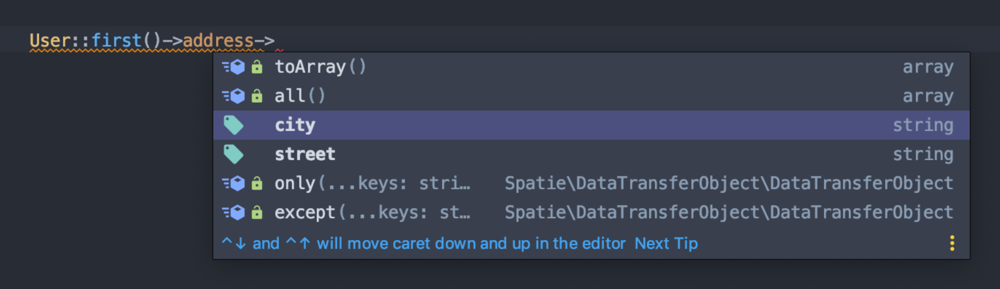

Since [custom casts](https://laravel.com/docs/7.x/eloquent-mutators#custom-casts) have finally arrived with Laravel 7, we can take full advantage of this new feature to get full autocomplete and type checking of JSON columns.

To achieve this, we can use [data-transfer-object](https://github.com/spatie/data-transfer-object) by [Spatie](https://spatie.be/), since native DTOs aren't supported in PHP (I'd recommend taking a look at it first, before reading this post). It can be installed by running:

```bash
composer require spatie/data-transfer-object
```

### Default JSON columns casting

Having the following migration:

```php
class CreateUsersTable extends Migration
{
    public function up()
    {
        Schema::create('users', function (Blueprint $table) {
            $table->json('address')->nullable();
        });
    }
}
```

This is how we can define the deserialization method for the `address` column in our `User` model:

```php
class User extends Authenticatable
{
    protected $casts = [
        'address' => 'array',
    ];
}
```

However, our IDE can't tell us what's inside `$user->address`. In addition, there is no validation while saving something into the `address` column.

### Custom JSON to DTO cast

Custom casts are just classes that implement the `CastsAttributes` interface, which requires us to define the `get` and `set` methods. 

Having the following user address DTO:

```php
<?php

namespace App\Dto;

use Spatie\DataTransferObject\DataTransferObject;

final class UserAddress extends DataTransferObject
{
    public string $city;

    public string $street;
}
```

This is how our address cast would look like:

```php
<?php

namespace App\Casts;

use App\Dto\UserAddress;
use Illuminate\Contracts\Database\Eloquent\CastsAttributes;

class UserAddressCast implements CastsAttributes
{
    /**
     * @param  \Illuminate\Database\Eloquent\Model  $model
     * @param  string  $key
     * @param  mixed  $value
     * @param  array  $attributes
     * @return UserAddress|null
     */
    public function get($model, $key, $value, $attributes): ?UserAddress
    {
        if (! $value) {
            return null;
        }

        return new UserAddress(json_decode($value, true));
    }

    /**
     * @param  \Illuminate\Database\Eloquent\Model  $model
     * @param  string  $key
     * @param  mixed  $value
     * @param  array  $attributes
     * @return string
     * @throws \Exception
     */
    public function set($model, $key, $value, $attributes): string
    {
        if (! $value instanceof UserAddress) {
            throw new \Exception("The provided value must be an instance of ".UserAddress::class);
        }

        return json_encode($value->toArray());
    }
}
```

Basically inside the `get` method, we are decoding the JSON column and return a freshly initialized `UserAddress` DTO. However, if the column is null (it might be nullable in our database), we're returning null.

Inside the `set` method, we're just checking if we've received an instance of `UserAddress` and serialize the DTO back to JSON using the `toArray` method, provided by `DataTransferObject`, which is the parent of `UserAddress`.

All that's left is to change `array` to `UserAddressCast::class` in our user model:

```php
class User extends Authenticatable
{
    protected $casts = [
        'address' => UserAddressCast::class,
    ];
}
```

And now this is how we would fill user's address:

```php
// If address is null initially:
$user->address = new UserAddress([
    'city' => 'Cool City',
    'street' => 'Nice Street',
]);

// If address is already filled:
$user->address->city = 'Another Cool City';

$user->address->street = 'Another Nice City';
```

Same goes in factories:

```php
$factory->define(User::class, function (Faker $faker) {
    return [
        'address' => new UserAddress([
          'city' => 'Cool City',
          'street' => 'Nice Street',
        ]),
    ];
});
```

### Automating JSON to DTO casting

Wouldn't it be a pain if we've had to define such long casting classes for each DTO? Well, we can define an abstract DTO cast which will be extended in the future:

```php
<?php

namespace App\Casts;

use Illuminate\Contracts\Database\Eloquent\CastsAttributes;
use Spatie\DataTransferObject\DataTransferObject;

abstract class DTOCast implements CastsAttributes
{
    /**
     * @return string
     */
    abstract protected function dtoClass(): string;

    /**
     * @param  \Illuminate\Database\Eloquent\Model  $model
     * @param  string  $key
     * @param  mixed  $value
     * @param  array  $attributes
     * @return DataTransferObject|null
     */
    public function get($model, $key, $value, $attributes): ?DataTransferObject
    {
        if (!$value) {
            return null;
        }

        $dtoClass = $this->dtoClass();

        return (new $dtoClass)(json_decode($value, true));
    }

    /**
     * @param  \Illuminate\Database\Eloquent\Model  $model
     * @param  string  $key
     * @param  mixed  $value
     * @param  array  $attributes
     * @return string
     * @throws \Exception
     */
    public function set($model, $key, $value, $attributes): string
    {
        $dtoClass = $this->dtoClass();

        if (!$value instanceof $dtoClass) {
            throw new \Exception("The provided value must be an instance of ".$dtoClass);
        }

        return json_encode($value->toArray());
    }
}
```

The `get` and `set` methods have the exact same logic as in the `UserAddressCast` example above. However, notice that we've defined an abstract method `dtoClass` which must return a DTO class name.

Now our `UserAddressCast` becomes this:

```php
<?php

namespace App\Casts;

use App\Dto\UserAddress;

final class UserAddressCast extends DTOCast
{
    protected function dtoClass(): string
    {
        return UserAddress::class;
    }
}
```

### Getting autocomplete to work

The only way I know to get proper autocompletion in Laravel, is by using the awesome [Laravel IDE Helper](https://github.com/barryvdh/laravel-ide-helper) by [Barry vd. Heuvel](https://twitter.com/barryvdh). It can be installed by running:

```bash
composer require --dev barryvdh/laravel-ide-helper
```

Now automatic phpDocs for models can be generated by running this in your project:

```bash
php artisan ide-helper:models
```

**laravel-ide-helper** will mark the `address` column as an `UserAddressCast` type, which in reality must be an `UserAddress` type, but  fortunately, this package provides a configurable option for casting types overriding.

Publish the config by running:

```bash
php artisan vendor:publish --provider="Barryvdh\LaravelIdeHelper\IdeHelperServiceProvider" --tag=config
```

> It will publish the config to `config/ide-helper.php`.

Now, we can override the casting class with our real DTO class, using the `type_overrides` option inside the published config:

```php
'type_overrides' => [
    '\\'.UserAddressCast::class => '\\'.UserAddress::class,
],
```

After updating the config, regenerate the phpDocs and that's it!



---

Thanks for reading this post! Subscribe below and get notified when new posts will be released or follow me on [Twitter (@sandulat)](https://twitter.com/sandulat).

